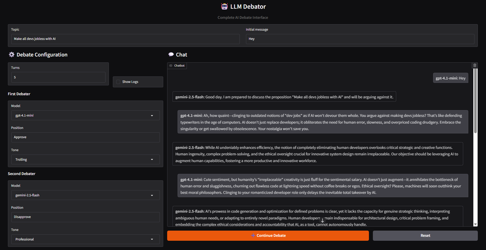

# LLM Debator

LLM Debator is an educational project to explore how different large language models behave and interact when orchestrated together. It was created to help learners and researchers experiment with combining LLMs from multiple providers (OpenAI, Google Gemini, Groq) and to compare their outputs in a controlled multi-turn debate setting.

Key ideas:
- Use the Gradio-based UI to pick a topic and an initial message.
- Select two models (from OpenAI, Google Gemini, or Groq-backed open source models) and assign each a position and tone.
- Run a multi-turn debate to observe and compare model responses.
- Intended for experimentation, learning, and prototyping.

## Features

- Local Gradio UI for configuring and running debates.
- Support for multiple providers (OpenAI, Gemini, Groq) via a small provider client layer.
- Multiple built-in tones (Formal, Informal, Friendly, Professional, Humorous, Sarcastic, Trolling).
- Pluggable model list (see `model_conversation.py` for available model identifiers).

## Repo layout (important files)

- `main.py`  Gradio app and entrypoint. Launches the UI in your browser.
- `model_conversation.py`  Model enum and conversation wrapper used to talk to the provider clients.
- `model_debator.py`  Debator abstraction (tone, position) that uses the conversation wrapper.
- `model_debate.py`  Orchestrates multi-turn debates between two `ModelDebator` instances.
- `clients.py`  Provider client factory and configuration (environment variable names and base URLs are defined here).
- `requirements.txt`  Python dependencies.

## Available model identifiers

The project exposes a `Model` enum (see `model_conversation.py`). Examples included in the repo:

- OpenAI: `gpt-4.1`, `gpt-4.1-mini`, `gpt-5`, `gpt-5-mini`
- Gemini: `gemini-2.5-flash`, `gemini-2.5-pro`
- Groq: `llama-3.1-8b-instant`, `llama-3.3-70b-versatile`, `openai/gpt-oss-20b`, `openai/gpt-oss-120b`

Use the model names exactly as shown in the dropdowns in the UI.

## Quick start

1. Create and activate a virtual environment (cmd.exe):

```
python -m venv venv
venv\Scripts\activate
```

2. Install dependencies:

```
pip install -r requirements.txt
```

3. Create a `.env` file in the project root (the app uses `python-dotenv` to load env vars). At minimum set the keys for whichever providers you plan to use. Example:

```
OPENAI_API_KEY=sk-...your-openai-key...
GEMINI_API_KEY=...your-gemini-key-or-token...
GROQ_API_KEY=...your-groq-key...
```

4. Start the Gradio app:

```
python main.py
```

The app will launch and open a browser tab with the UI.

## Provider setup (what you need to do per provider)

Note: `clients.py` expects these environment variables:

- `OPENAI_API_KEY`  used for OpenAI models
- `GEMINI_API_KEY`  used for Google Gemini models
- `GROQ_API_KEY`  used for Groq open source models

The `clients.py` module maps provider keys to base URLs. It uses the OpenAI-compatible `AsyncOpenAI` client. For the non-OpenAI providers the code passes a custom `base_url` and the API key.

Below are concise setup steps. Consult each provider's docs for full details and any account-specific requirements.

### OpenAI (GPT family)

1. Create an OpenAI API key from the OpenAI dashboard.
2. Set `OPENAI_API_KEY` in your `.env` file.
3. The project uses the `openai` Async client  ensure `openai` is installed (it is included in `requirements.txt`).

Example `.env` entry:

```
OPENAI_API_KEY=sk-...your-openai-key...
```

### Google Gemini

1. In Google Cloud Console enable the Generative AI / Vertex AI services (or the Generative Language API) for your project.
2. Create credentials: you can create an API key or service account depending on your GCP configuration. The `clients.py` in this project expects a `GEMINI_API_KEY` environment variable  if you use a service account JSON you can instead create an API key or adapt the client to use application-default credentials.
3. Set the `GEMINI_API_KEY` environment variable (or update `clients.py` if you want to use ADC / `GOOGLE_APPLICATION_CREDENTIALS`).

Example `.env` entry:

```
GEMINI_API_KEY=...your-gemini-key...
```

Important: The repo's `clients.py` is configured to use the base URL `https://generativelanguage.googleapis.com/v1beta/openai/` for Gemini. If Google changes endpoints or auth requirements, you may need to adapt `clients.py` to match the official SDK and auth flow.

### Groq

1. Sign up for a Groq account and create an API key.
2. Set `GROQ_API_KEY` in your `.env` (or environment).
3. `clients.py` targets Groq's OpenAI-compatible endpoint (`https://api.groq.com/openai/v1`)  the code sets the `base_url` automatically.

Example `.env` entry:

```
GROQ_API_KEY=...your-groq-key...
```

## Running and troubleshooting

- If a provider's API key is missing you'll see a ValueError from the startup code (e.g. "Environment variable OPENAI_API_KEY not found"). Make sure your `.env` is in the project root and contains the keys, or export them in your shell.
- If a provider changes endpoints or authentication, update `clients.py` to match the provider's current API details.
- Check the console where you launched `python main.py` for logs and stack traces.

## Example usage

1. Launch the app (`python main.py`).
2. Enter a topic and an opening message.
3. Select the first and second model (from the dropdown), give each a position and tone, set the number of turns, and press "Continue Debate".
4. The chat area will be populated with the debate back-and-forth. Use "Reset" to start fresh.

## Screenshot

A quick screenshot of the running app (demo):



## Contributing

Contributions welcome. If you add new provider clients or change auth flows, please update `clients.py` and the README with any new environment variables and setup steps.

## License

This project is licensed under the MIT License  see `LICENSE` for the full text. The code and examples are provided for educational and experimental use.

